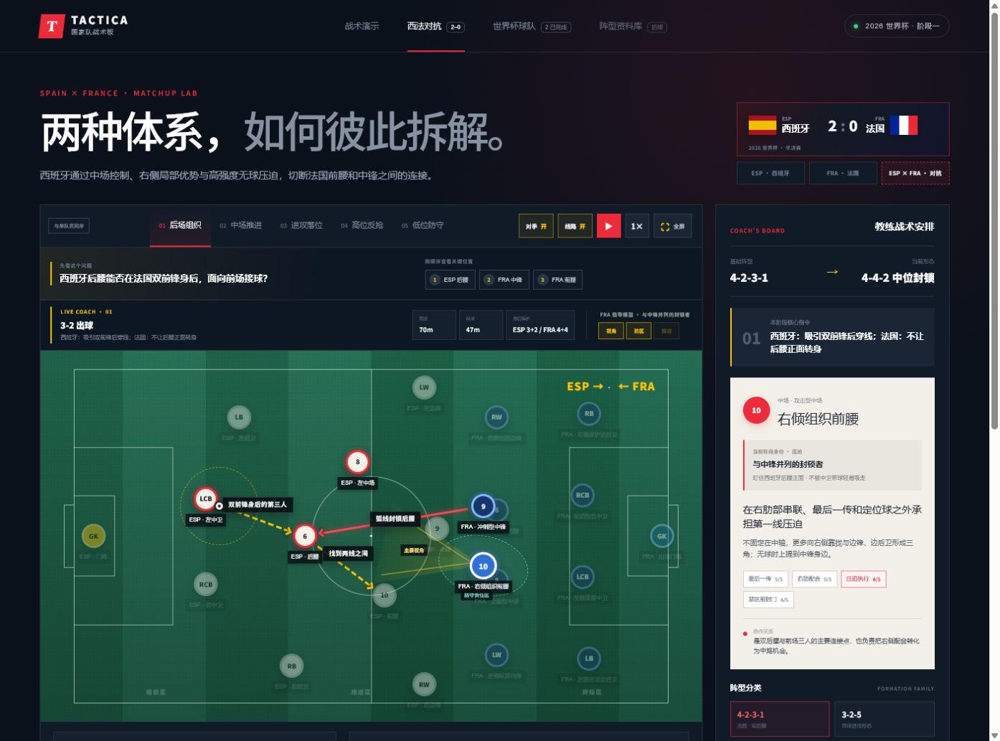

# TACTICA 国家队战术板

一个用于动态展示国家队阵型、位置职责和攻防阶段变化的足球战术网站。



当前内容包括：

- 西班牙国家队五阶段战术演示
- 法国国家队五阶段战术演示
- 西班牙对法国的动态对抗分析
- 后场组织、中场推进、进攻落位、高位反抢、低位防守
- 传球、跑动、压迫、保护、视角、防区与推进路线图层

## 环境要求

- Node.js `>= 22.13.0`
- npm（随 Node.js 一同安装）

建议使用 Node.js 22 LTS 或更高版本。

## 从 GitHub 启动

以下命令在 Windows PowerShell、macOS 和 Linux 中相同：

```bash
git clone https://github.com/civaapple-alt/spainagent.git
cd spainagent
npm install
npm run dev
```

启动成功后，终端会显示本地访问地址，通常为：

```text
http://localhost:3000/
```

如果 `3000` 端口已被占用，请使用终端显示的实际地址。

## 常用命令

```bash
# 启动开发服务器
npm run dev

# 检查代码规范
npm run lint

# 生成生产构建
npm run build

# 启动已构建的生产版本
npm run start
```

## 项目结构

```text
app/
  tactics/                 战术组件、类型与数据模型
  tactics/data/spain.ts    西班牙队数据
  tactics/data/france.ts   法国队数据
  tactics/data/matchups/   球队对抗数据
  tactics-lab.tsx          战术页面入口
```

## 数据说明

本项目将公开比赛报告、统计数据和教练视角的战术解释整理成动态战术模型。页面中的站位、跑动与箭头用于表达战术原则，不是逐帧球员追踪数据。

## 技术栈

- React 19
- Next.js / vinext
- TypeScript
- Vite
- Cloudflare Workers 兼容构建

## 当前开发计划

- 完善西班牙与法国的对抗阶段
- 增加英格兰、阿根廷等国家队
- 支持更多球队之间的战术对抗模拟
